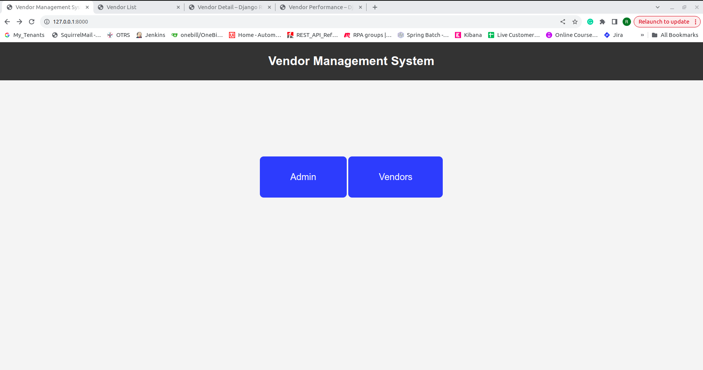
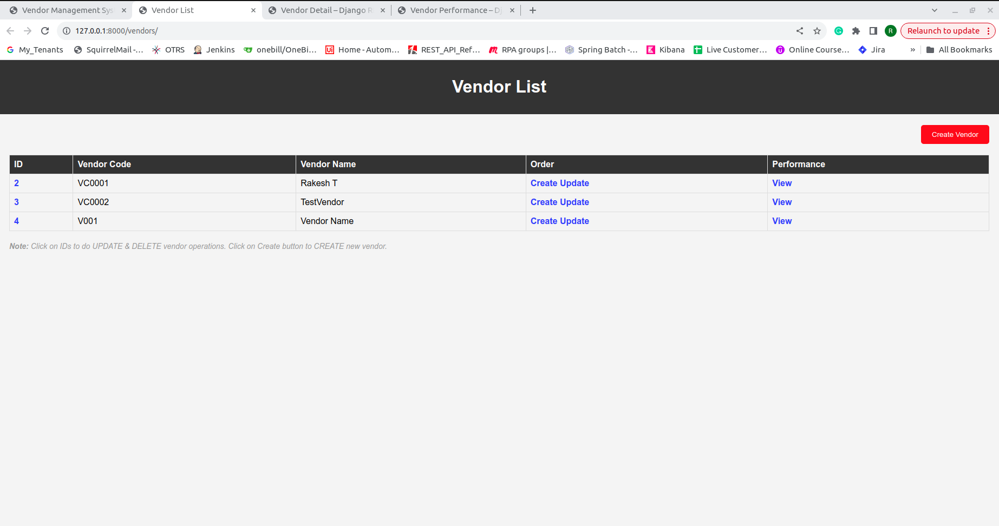
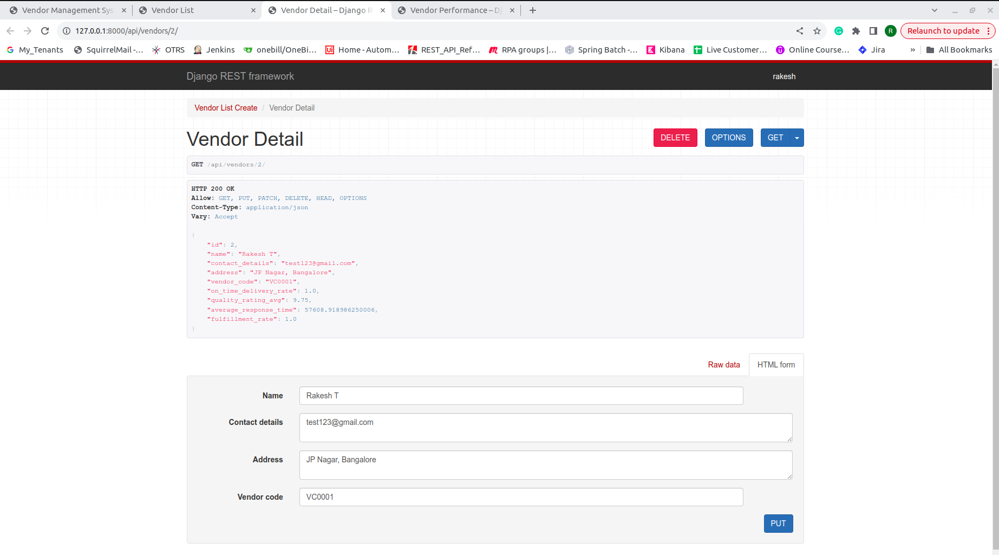
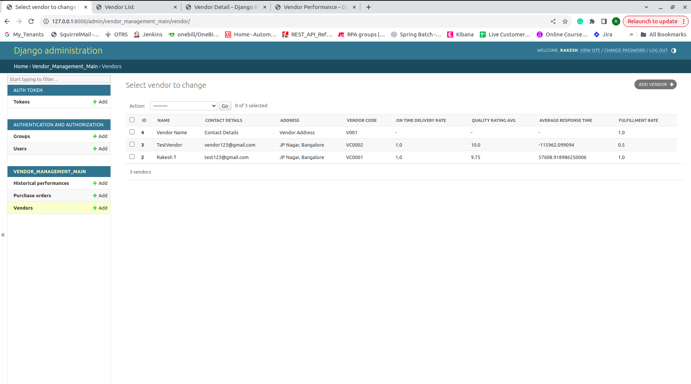
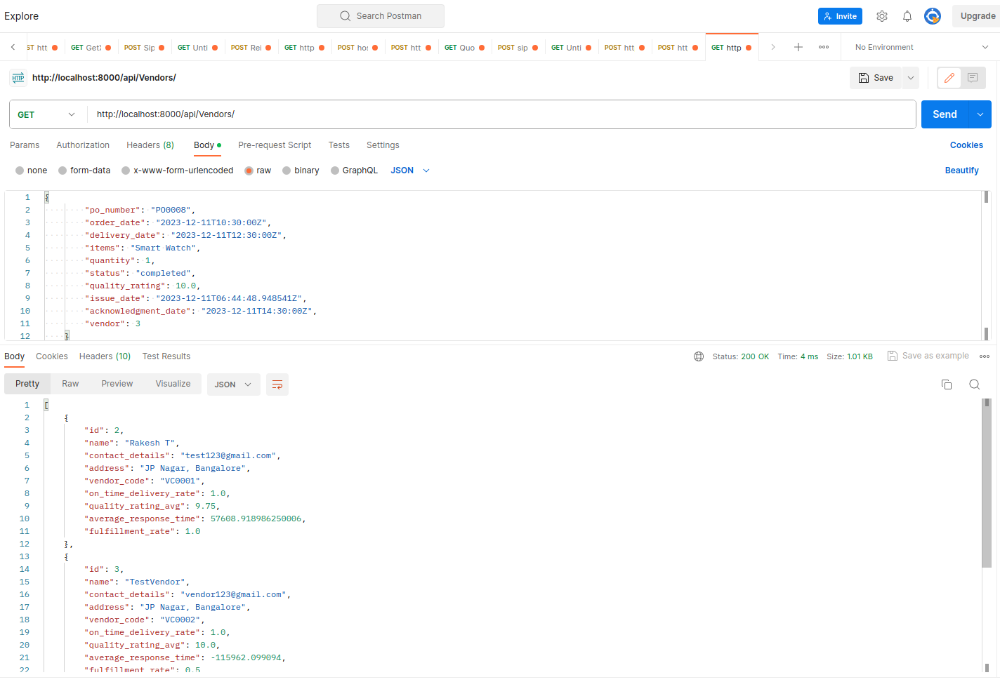
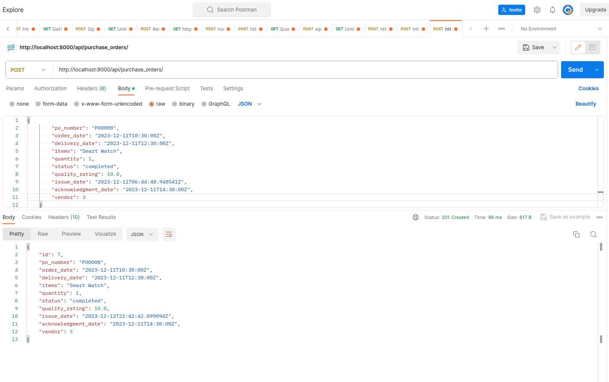
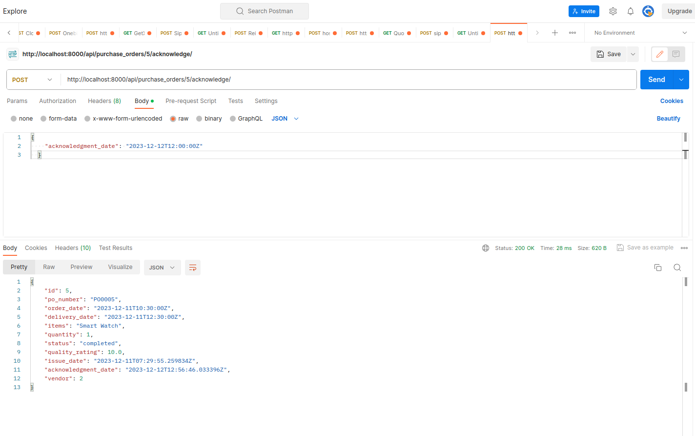
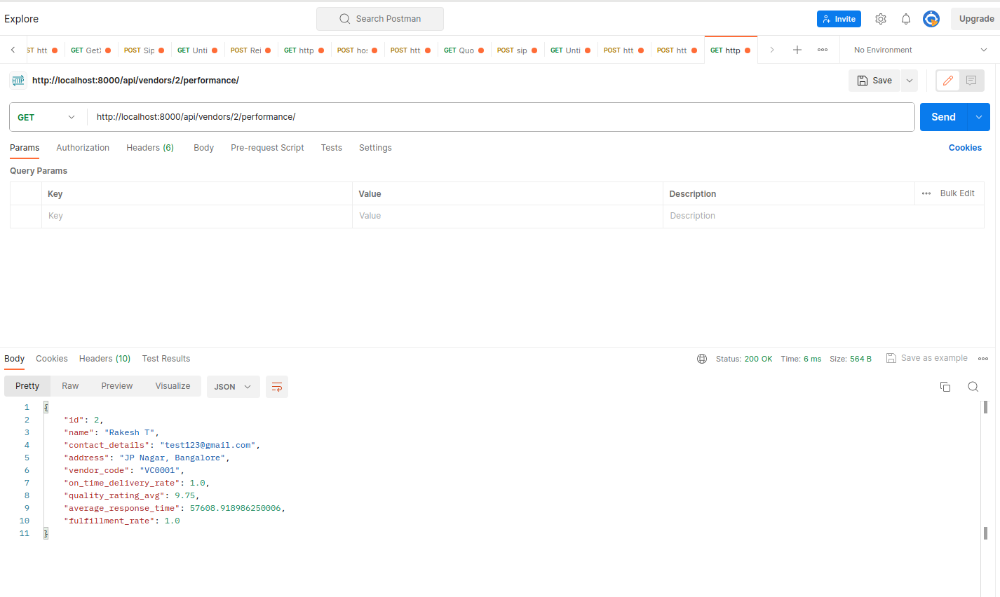

# Vendor Management System

## Table of contents

[Project Description](https://github.com/Rakesh3537/Vendor_Management_System/blob/main/README.md#project-description)

[Features](https://github.com/Rakesh3537/Vendor_Management_System/blob/main/README.md#features)

[Roadmap](https://github.com/Rakesh3537/Vendor_Management_System/blob/main/README.md#roadmap)

[Tech Stack](https://github.com/Rakesh3537/Vendor_Management_System/blob/main/README.md#tech-stack)

[Installation](https://github.com/Rakesh3537/Vendor_Management_System/blob/main/README.md#installation)

[Test Suite Command](https://github.com/Rakesh3537/Vendor_Management_System/blob/main/README.md#test-suite-command)

[API References](https://github.com/Rakesh3537/Vendor_Management_System/blob/main/README.md#api-reference)

[Screenshots](https://github.com/Rakesh3537/Vendor_Management_System/blob/main/README.md#screenshots)

[Pending Items](https://github.com/Rakesh3537/Vendor_Management_System/blob/main/README.md#pending-items)

[Author/Company](https://github.com/Rakesh3537/Vendor_Management_System/blob/main/README.md#assignement-by)

[Contact](https://github.com/Rakesh3537/Vendor_Management_System/blob/main/README.md#contact)

## Project Description

The Vendor Management System is a web application built using Python, Django, Django Rest Framework that facilitaties the management of Vendors and their order tracking.  

It provides features such as managing vendor profiles, tracking purchase orders, and evaluating vendor performance. 

Users can create, update, and delete vendor profiles, purchase orders, and monitor vendor performance metrics such as on-time delivery rate, quality rating average, average response time, and fulfillment rate. 


## Features

- **Users/Admin:** Easily create a new Vendor or modify or delete the Vendors.
- **Users/Admin:** Can easily find the historical Performance for individual Vendors.
- **Vendors:** Can easily purchase N number of orders.
- **API Support** Have API support to perform all operations.
- **API Endpoints** Have API to create/update/delete Vendors, Have API to purchase/modify/delete an orders, Have API to acknowledge an Order and Have API to View the Performance for the Specific Vendor level.
- **Complexity** Easy to use
- **Security** Secure API Endpoints with Token-based authentication.


## Roadmap

- __Vendor Profiles:__ Will create a seperate section for Vendor Profiles Management like List Page.
- __Purchase Order:__ Will create a purchase Order section under the Specific Vendor in One-View Page.
- __Modify Order:__ Will implement the Orders as Subscription and modify the Order using the Gear icon.
- __Vendor Login:__ Implement Vendor Registration to access their Profiles in indvidual portal like Self-care. Admins can access the Venor profiles and Vendor creation, Vendors can access the portal to purchase Order and Order tracking purposes.
- __Channel Level:__ Implement the Channel Partner Management to increase the business level.


## Tech Stack

**Stack:** Python, Django, Django Rest Framework, dbsqlite3

**Server:** localhost:8000


## Installation

1. Clone the repository:

    ```bash
    git clone https://github.com/yourusername/vendor-management-system.git
    ```

2. Navigate to the project directory:

    ```bash
    cd vendor_management_system
    ```

3. Install dependencies:

    ```bash
    python -m venv venv

    source venv/Scripts/activate

    pip install django

    pip install djangorestframework

    pip install -r requirements.txt
    ```

4. Apply migrations:

    ```bash
    python manage.py makemigrations

    python manage.py migrate
    ```

5. Create SuperUser:

     ```bash
    python manage.py createsuperuser 
    ```

6. Run the development server:

    ```bash
    python manage.py runserver
    ```

7. Server:

    ```bash
    http://localhost:8000/  or http://127.0.0.1:8000/
    ```

## Test Suite Command

    ```bash
    # Run all tests in the app level
    python manage.py test vendor_management_main

    # Run tests in a specific test module
    python manage.py test vendor_management_main.tests.test_views

    # Run tests in a specific test class
    python manage.py test vendor_management_main.tests.test_views.VendorManagementTests

    # Run tests with verbose output
    python manage.py test --verbosity 2 vendor_management_main
    ```

## API Reference

#### Vendor Profile:

```http
  POST /api/createVendor/: Create a new vendor.
  GET /api/vendors/: List all vendors.
  GET /api/vendors/{vendor_id}/: Retrieve a specific vendor's details.
  PUT /api/vendors/{vendor_id}/: Update a vendor's details.
  DELETE /api/vendors/{vendor_id}/: Delete a vendor.
```


#### Order Management:

```http
  POST /api/purchase_orders/: Create a purchase order.
  GET /api/purchase_orders/: List all purchase orders with an option to filter by vendor.
  GET /api/purchase_orders/{po_id}/: Retrieve details of a specific purchase order.
  PUT /api/purchase_orders/{po_id}/: Update a purchase order.
  DELETE /api/purchase_orders/{po_id}/: Delete a purchase order.

  POST /api/purchase_orders/{po_id}/acknowledge/: Create a purchase order.
```


#### Historical Performance:

```http
  GET /api/vendors/{vendor_id}/performance
```


## Screenshots

__HTML Pages Screenshots__

__Landing Page__



__Vendor List Page__



__Vendor Detail Page__



__Admin Page UI__


__API Screenshots__

__Vendor List API Endpoint__



__Purchase Order API Endpoint__



__Acknowledge API Endpoint__



__Historical Performance API Endpoint__




## Pending Items

- __UI Design:__ Currently used the Django Rest Framework content to display in UI. In Future, will create a seperate UI designs for each model.
- __API Authentication:__ Implemented Token-based API Endpoints. But currently not in Use due to the Django Rest Framework UI implemenation (Implemented in code, but Commented the logics). Will deploy in future. 


## ASSIGNED BY

This project is assigned by the company:

- [FATMUG, Delhi, India](https://www.linkedin.com/company/fatmug-designs/)


## Contact

If you have any questions or suggestions, feel free to contact me,

Email - rakeshyadhav575@gmail.com

LinkedIn - [Rakesh T](https://www.linkedin.com/in/rakesh-t-1489341b7)
